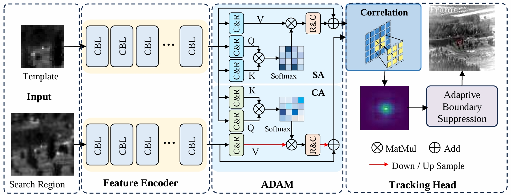

# SiamlTo-Tiny

## 📄 **Edge real-time tracking and FPGA-based hardware implementation for infrared tiny object**
> *(Paper Title)*

## 🧠 Network Architecture

## 🛠️ Training Environment  
| Component             | Specification               |
|:----------------:|:----------------------------:|
| **GPU**          | NVIDIA RTX 3080 (10GB VRAM)   |
| **CPU**          | Intel i9-11900K @ 3.5GHz      |
| **OS**      | Ubuntu 18.04 LTS              |
| **Python**       | 3.7 (Anaconda Environment)   |
| **PyTorch/CUDA** | 1.8.0 + CUDA 11.1             |

## 📦 Dataset

The dataset used for training and evaluation can be obtained from (https://www.scidb.cn/en/detail?dataSetId=720626420933459968) <!-- [this link]([https://example.com](https://www.scidb.cn/en/detail?dataSetId=720626420933459968)).  -->

## 📁 Project Structure
We organize our project as follows:

- [`SiamITO-Tiny`](./SiamITO-Tiny): Contains the core implementation of **SiamlTo-Tiny**, including model architecture, training scripts.
- [`score=0.9206`](./score=0.9206): Stores experimental results, performance metrics, and evaluation outputs.

